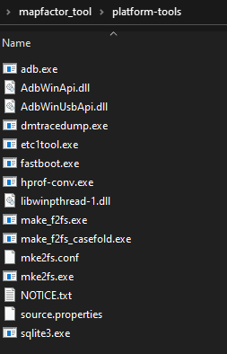
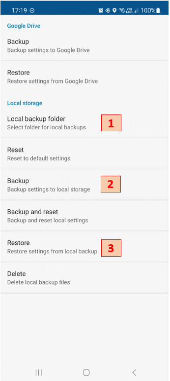
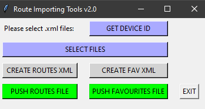

# Mapfactor Navigator Route Importing Tool

This tool is created to extract routes and favourite points from GPX files created
in [BaseCamp Garmin](https://www.garmin.com/en-US/software/basecamp/), create routing_points.xml and favourites.xml and import them to Mapfactor Navigator.

It uses Adb from Android SDK tools to access the device. Information about the usage of
Adb and download link for platform-tools can be found below:<br />

[Android SDK Adb Info](https://developer.android.com/tools/adb)<br />
[Android SDK Platform-tools Download](https://developer.android.com/tools/releases/platform-tools)<br />

After download the "platform-tools" folder needs to be place in the root directory

 

Run the following to install requirements
```bash
pip install -r requirements.txt
```

After initial Mapfactor Navigator installation on the Android device few steps need to be perform once.
1. First go to **Settings > Advanced > Backup and reset > Local backup folder**<br />
	This will let you choose a local folder for the backup of the app. That is to avoid using the default
	which cannot be accessed by the adb commands. Create a "Navigator" folder in the root directory and select use this folder.
2. Then, create a first backup from **Settings > Advanced > Backup and reset > Backup**<br />
	On this backup that is created now, the tool will replace routing_points.xml and favourites.xml files each time you use it.
3. After creating your first routes and favourite points you can push them to the device. To use them in the app you need to **Restore** the initial backup and select only **Favourite places** and **Routing points and my routes**. Keep in mind that if more backups are made, the tool will access the first created only.




## Usage:

1. Connect Android device via USB
2. Ensure USB debugging is enabled
3. Ensure PC is autorized to access the device
4. Run main.py
5. **GET DEVICE ID**
6. **SELECT FILE** and select a gpx file
7. **CREATE ROUTES XML** to create routing_points.xml
8. **CREATE FAV XML** to create favourites.xml
9. **PUSH ROUTES FILE** to push routing_points.xml to device
10. **PUSH FAVOURITES FILE** to push favourites.xml to device
11. Exit or select new file

  